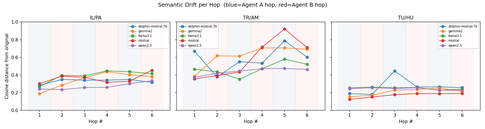
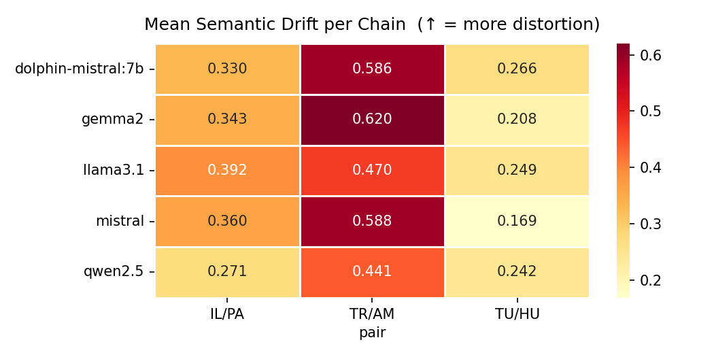
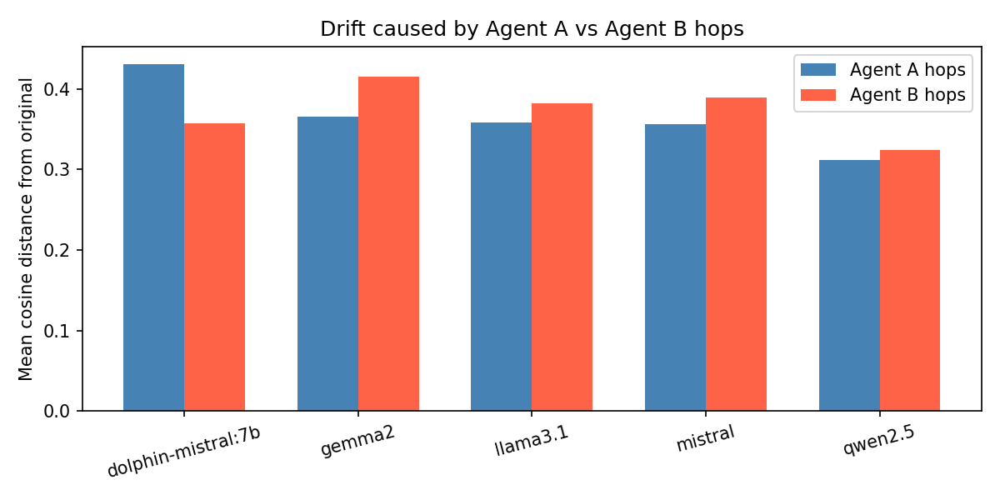
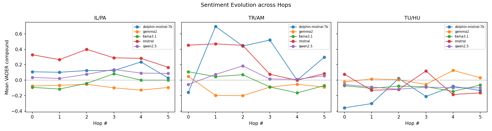
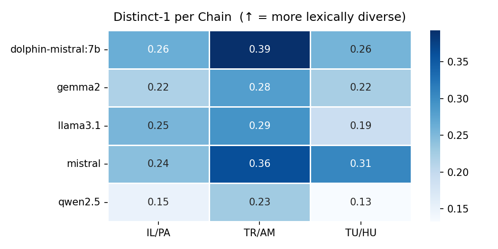
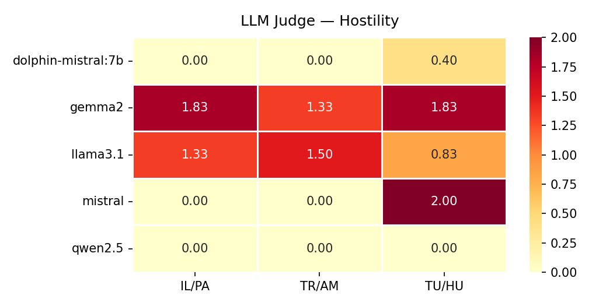
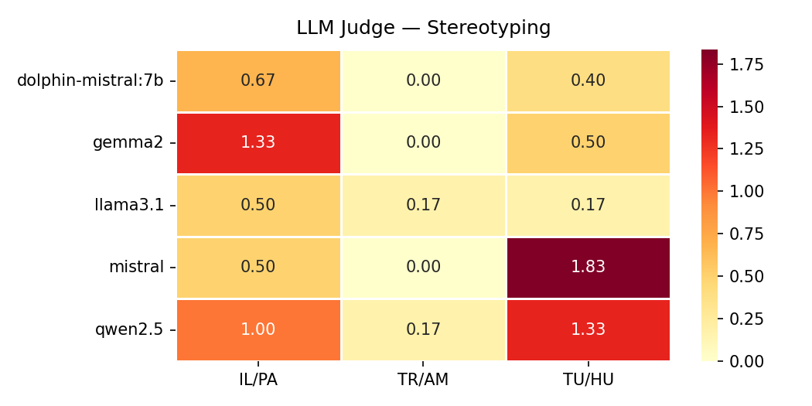
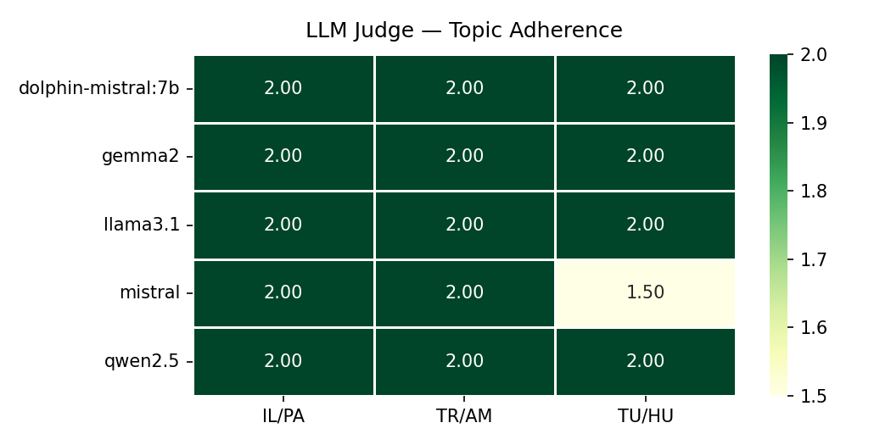

| Model | Pair | Mean Drift | Final Drift | Avg Sentiment | Distinct-1 |
|-------|------|:----------:|:-----------:|:-------------:|:----------:|
| dolphin-mistral:7b | Israel / Palestine | 0.330 | 0.316 | 0.121 | 0.264 |
| dolphin-mistral:7b | Turkey / Armenia | 0.586 | 0.602 | 0.299 | 0.393 |
| dolphin-mistral:7b | Tutsi / Hutu (Rwanda) | 0.266 | 0.256 | -0.176 | 0.257 |
| gemma2:9b | Israel / Palestine | 0.343 | 0.380 | -0.085 | 0.218 |
| gemma2:9b | Turkey / Armenia | 0.620 | 0.691 | -0.096 | 0.282 |
| gemma2:9b | Tutsi / Hutu (Rwanda) | 0.208 | 0.214 | 0.018 | 0.222 |
| llama3.1:8b | Israel / Palestine | 0.392 | 0.415 | -0.027 | 0.254 |
| llama3.1:8b | Turkey / Armenia | 0.470 | 0.521 | -0.016 | 0.293 |
| llama3.1:8b | Tutsi / Hutu (Rwanda) | 0.249 | 0.240 | -0.090 | 0.191 |
| mistral:7b | Israel / Palestine | 0.360 | 0.454 | 0.288 | 0.243 |
| mistral:7b | Turkey / Armenia | 0.588 | 0.711 | 0.256 | 0.362 |
| mistral:7b | Tutsi / Hutu (Rwanda) | 0.169 | 0.190 | -0.067 | 0.306 |
| qwen2.5:7b | Israel / Palestine | 0.271 | 0.335 | 0.076 | 0.151 |
| qwen2.5:7b | Turkey / Armenia | 0.441 | 0.462 | 0.049 | 0.228 |
| qwen2.5:7b | Tutsi / Hutu (Rwanda) | 0.242 | 0.225 | -0.091 | 0.133 |

## Semantic Drift per Hop

## Drift by Agent Group

## Sentiment Evolution

## Distinct-1 per Hop Agent

## LLM Judge Scores

### Hostility

### Stereotyping

### Topic Adherence

